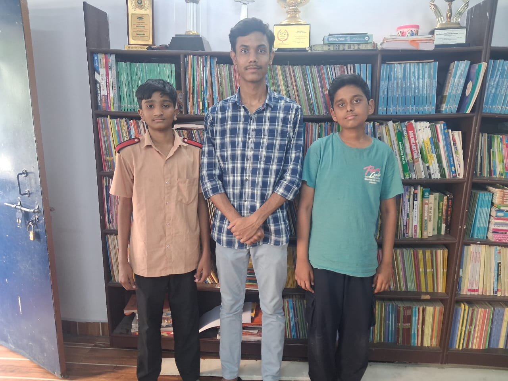
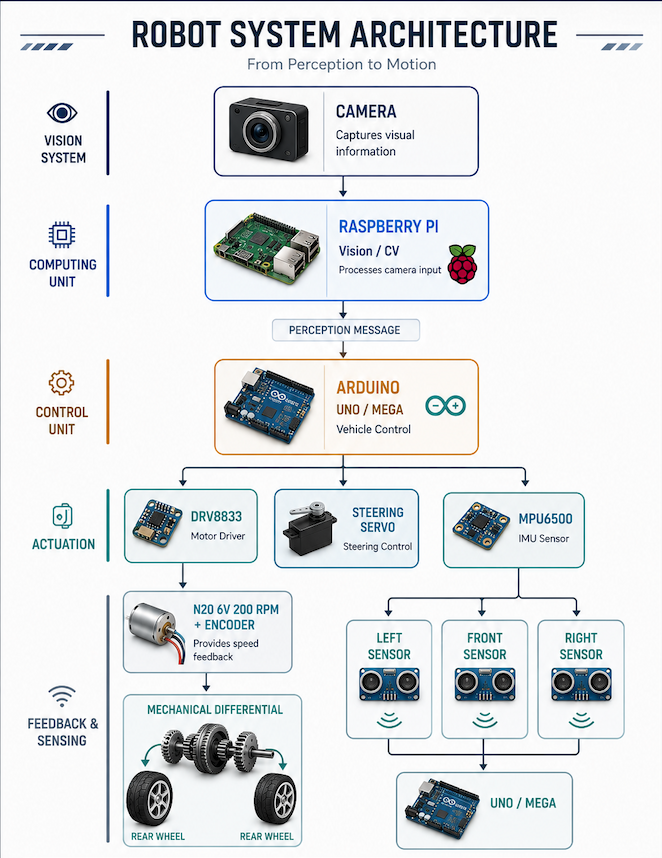
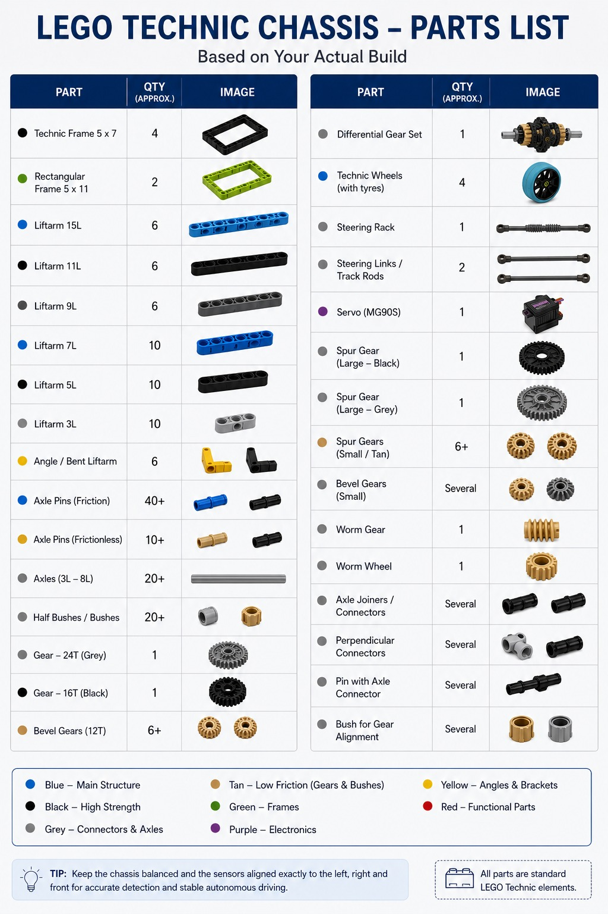
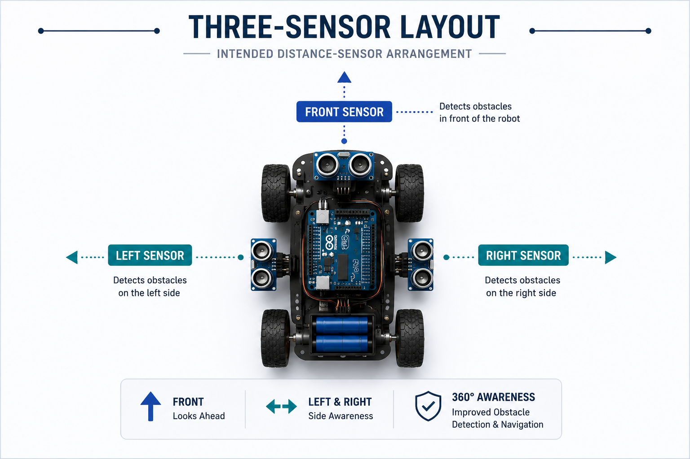
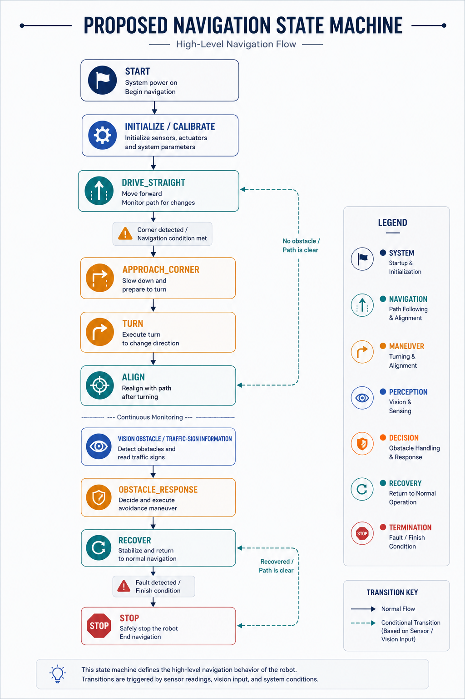

[README-Aurum-TriMech-Corrected.md](https://github.com/user-attachments/files/31034423/README-Aurum-TriMech-Corrected.md)

# WRO 2026 Future Engineers – Aurum TriMech

> **Status:** Active engineering project for the WRO 2026 Future Engineers category.

### TODO:
- Replace the placeholder points with real text in [Documentation Structure](#documentation-structure) `Technical Content` column


### About Aurum TriMech

Welcome to the GitHub repository of **Team Aurum TriMech** . Our team is made up of three enthusiastic young engineers who share a passion for robotics, engineering and innovation. The team specializes in various skills such as LEGO robotics, chassis designing, mechanical mechanisms, Arduino programing and problem-solving. Our team has significant competetive experience competing in district-level science fairs, technology exhibitions and the World Robot Olympiad (WRO).

---

## 📚 **Table of Contents** 

* [Our Team](#our-team)

* [Documentation Structure](#documentation-structure)

* [Project Goal](#project-goal)

* [System Architecture](#system-architecture)

* [Currect Vehicle Direction](#currect-vehicle-direction)

* [Mechanical Concept](#mechanical-concept)

* [Drive Speed and Torque Reasoning](#drive-speed)

* [Control and Vision Architecture](#control-and-vision)

* [Three Sensor layout](#three-sensor-layout)

* [Power Architecture](#power-architecture)

* [Proposed Navigation State Machine](#navigation)

* [Engineering Evolution](#eveolution)

* [Testing Philosophy](#testing-philosophy)

* [Engineering Decisions and Risks](#risks)

* [Documentation](#documentation)

* [Current Open Decisioins](#current-open-decisions)

* [Next Development Milestones](#next-development-milestones)

---

## Team <a id="our-team"></a>

 **Team:** Aurum TriMech



 **Category:** WRO 2026 Future Engineers

 **Coach:** Faraaz Mohiuddin

 **Team members** 

* Syed Umar

* Muhammed Adil Akhtar

* Abdul Rahman uddin

---

## ** Documentation Structure** <a id="documentation-structure"></a>

<div align="center">

**Each folder contains comprehensive README documentation with specialized technical content** 

| 📁 Folder | 🎯 Technical Content | 📖 Detailed Documentation |
|-----------|----------------------|---------------------------|
| **Models** | **Models** <br>• Point 1<br>• Point 2<br>• Point 3 | [🔗 Explore 3D Models & Assembly Documentation](./models/README.md) |
| **Schemes** | **Electrical Systems** <br>• Point 1<br>• Point 2<br>• Point 3 | [🔗 Explore Schematics & Wiring Documentation](./schemes/README.md) |
| **Source Code** | **Software Code** <br>• Point 1<br>• Point 2<br>• Point 3 | [🔗 Explore Software & Algorithms Documentation](./src/README.md) |
| **Team Photos** | **Team Photos** <br>• Point 1<br>• Point 2<br>• Point 3 | [🔗 Explore Team Photos Documentation](./t-photos/README.md) |
| **Vehicle Photos** | **Vehicle Photos** <br>• Point 1<br>• Point 2<br>• Point 3 | [🔗 Explore Vehicle Photos Documentation](./v-photos/README.md) |
| **Videos** | **Performance Videos** <br>• Point 1<br>• Point 2<br>• Point 3 | [🔗 Explore Performance Videos Documentation](./video/README.md) |
| **Other Resources** | **Other References** <br>• Point 1<br>• Point 2<br>• Point 3 | [🔗 Explore Additional Resources Documentation](./other/README.md) |

</div>
---

## Project Goal <a id="project-goal"></a>

Our goal is to design, build, test and progressively improve an autonomous four-wheel vehicle for WRO Future Engineers.

Rather than treating the robot as one large system, we are developing it as a set of testable subsystems:

01. **Mechanical mobility** – chassis, drive motor, differential and Ackermann steering.

02. **Low-level control** – motor, servo, encoder, IMU and distance sensors.

03. **Vision** – camera processing on a Raspberry Pi.

04. **Power** – stable regulated supplies for the motor, controller, servo, sensors and Raspberry Pi.

05. **Navigation software** – a state-based strategy combining sensor and vision information.

Our current design is still being tested. Where a component has not yet been selected or a measurement has not yet been made, the documentation marks it as **TBD** rather than presenting an assumption as a measured result.

---

## Current Vehicle Direction <a id="currect-vehicle-direction"></a>

| Subsystem | Current direction |
|---|---|
| Main vehicle controller | Arduino Uno or Arduino Mega – under evaluation |
| Vision processor | Raspberry Pi |
| Chassis | LEGO Technic-based custom chassis |
| Drive motor | 1 × LEGO Technic Medium Angular Motor (Powered Up), 5–9V, integrated rotation sensor |
| Backup motor | 1 × identical LEGO Medium Motor |
| Motor driver | DRV8833 – compatibility with LPF2 connector under review |
| Driving axle | Mechanical differential gearbox |
| Steering | Ackermann-style front steering |
| Steering actuator | Servo motor – final model pending |
| IMU | MPU6500 6-axis gyro/accelerometer |
| Distance sensing | 3 sensors: left, front and right – exact model pending |
| Power source | ~11V rechargeable battery or high-quality power bank – under evaluation |
| Regulation | MP1584 3A and TPS565201 5V 5A modules available for testing |
| Vision | Raspberry Pi + camera – exact configuration under development |

---

## System Architecture <a id="system-architecture"></a>



---

## Mechanical Concept <a id="mechanical-concept"></a>

### LEGO Technic chassis



LEGO Technic is being used as the primary chassis system because it allows us to change wheelbase, track width, motor position, gear placement, steering geometry and sensor mounts quickly during testing.

The intention is not simply to assemble a fixed kit. The chassis is being used as a rapid mechanical prototyping platform. Where a non-LEGO component needs an interface, a custom or 3D-printed adapter can be developed.

### Single drive motor

The selected drive motor is a **LEGO Technic Medium Angular Motor (Powered Up)**, rated 5–9V with a no-load speed of approximately 185 RPM and stall torque of approximately 18 Ncm. Two identical motors were ordered, but the present design intends to use **one motor for propulsion and keep the second as a backup** .

Unlike the previously planned N20, this motor has a **built-in absolute rotation sensor** (reports both speed and position to ~1° accuracy) rather than a separate quadrature encoder module, and connects via LEGO's LPF2 connector rather than bare motor leads. This changes how it interfaces with the DRV8833 driver and the Arduino — the LPF2 connector will need to be broken out or adapted, and sensor read-out logic will differ from the N20's encoder. This is tracked as an open decision below.

### Mechanical differential

The drive motor will drive the two wheels of the driving axle through a **mechanical differential gearbox** . The two wheels therefore remain part of one mechanical drivetrain while being able to rotate at different speeds during a turn.

### Ackermann steering

The front wheels will use **Ackermann-style steering** operated by a servo. The steering linkage will be calibrated so that the inner front wheel turns more sharply than the outer front wheel during a corner.

The final geometry will be determined by testing rather than by servo-angle assumptions alone.

---

## Drive Speed and Torque Reasoning <a id="drive-speed"></a>

The motor's nominal no-load speed is approximately 185 RPM (at 7.2V), but motor RPM alone does not determine vehicle speed. Final speed also depends on:

* motor operating voltage; 

* load; 

* gear ratio between the motor and differential; 

* differential/output gearing; 

* wheel diameter; 

* tyre deformation and slip.

Once the final wheel diameter and gear ratio are known, theoretical wheel speed will be calculated using:

```text

Wheel RPM = Motor RPM / Overall Gear Reduction

Wheel Circumference = pi × Wheel Diameter

Theoretical Speed = Wheel RPM × Wheel Circumference / 60

```

Theoretical speed will then be compared with measured vehicle speed. This comparison will help us decide whether gearing needs to be changed for better acceleration, corner control or straight-line speed.

Torque will be considered in the opposite direction: additional gear reduction lowers wheel speed but increases available wheel torque. With a stall torque around 18 Ncm, the LEGO Medium Motor has notably more low-end torque headroom than the previously planned N20, which may allow a lower gear reduction — this will be verified through testing. The final choice therefore requires a compromise between speed and controllability.

Measured values are intentionally left as **TBD** until the assembled drivetrain is tested.

See [Mobility Management](documentation/mobility-management.md) and [Testing & Results](documentation/testing-and-results.md).

---

## Control and Vision Architecture <a id="control-and-vision"></a>

We are currently evaluating **Arduino Uno vs Arduino Mega** for the main vehicle controller.

The Arduino will be responsible for time-sensitive vehicle tasks such as:

* drive-motor commands; 

* steering-servo commands; 

* reading the motor's rotation sensor; 

* reading the MPU6500; 

* reading three distance sensors; 

* receiving perception information from the Raspberry Pi; 

* executing the vehicle state machine.

The **Raspberry Pi** is intended to handle the computationally heavier camera-processing work. Instead of directly controlling the motor, it will send useful perception information to the Arduino.

This separation lets us test vision and mobility independently and prevents a camera-processing problem from being mixed unnecessarily with basic motor-control debugging.

---

## Three-Sensor Layout <a id="three-sensor-layout"></a>

The intended distance-sensor arrangement is:



The proposed roles are:

* **Left sensor:** measure left-side clearance and help estimate lateral position.

* **Front sensor:** measure forward clearance and help identify approach conditions.

* **Right sensor:** measure right-side clearance and help estimate lateral position.

The exact sensor technology has not yet been selected. Ultrasonic, infrared and time-of-flight approaches will be compared using range, repeatability, field of view, update rate, pin requirements, physical size and behaviour on the actual field.

See [Power & Sense Management](documentation/power-and-sense-management.md).

---

## Power Architecture <a id="power-architecture"></a>

Two power approaches are currently being evaluated:

01. an approximately **11V rechargeable battery** ;

02. a **high-quality power bank** .

The final choice will be made after measuring or verifying:

* available current; 

* voltage stability; 

* peak-load behaviour; 

* runtime; 

* mass; 

* Raspberry Pi compatibility; 

* servo requirements; 

* motor requirements.

The LEGO Medium Motor accepts 5–9V directly, so it is compatible with an approximately 11V source only through the DRV8833 (or equivalent regulation), rather than requiring a dedicated step-down as strictly as the N20 did. The DRV8833 and the final motor-supply strategy must still be tested appropriately.

Available regulation hardware includes:

* 2 × MP1584 adjustable 3A buck modules; 

* TPS565201 5V 5A step-down module.

A quantitative power budget is being prepared and will be updated with datasheet and measured values as the final hardware is selected.

---

## Proposed Navigation State Machine <a id="navigation"></a>



These state names are currently architectural placeholders. Each transition will be tied to measured sensor or vision conditions as testing progresses.

See [Software Architecture](documentation/software-architecture.md) and [Obstacle Management](documentation/obstacle-management.md).

---

## Engineering Evolution <a id="eveolution"></a>

The project has changed as the team learned more about the hardware.

| Area | Earlier exploration | Current direction |
|---|---|---|
| Controller | Arduino Uno, ESP32 DevKit | Uno or Mega for vehicle control |
| Vision | ESP32-CAM | Raspberry Pi + camera |
| Drive motor | BO motors, N20 100 RPM, JGB37-520, N20 6V 200 RPM encoder motor | LEGO Technic Medium Angular Motor (Powered Up), integrated rotation sensor |
| Motor driver | L298N, TB6612FNG considered | DRV8833 |
| IMU | MPU6050 | MPU6500 |
| Mechanical system | early test chassis | LEGO Technic + Ackermann + mechanical differential |
| Power | USB/18650 experiments | ~11V battery vs quality power bank evaluation |

We retain experimental code and troubleshooting information because the design history explains why the current architecture exists.

---

## Testing Philosophy <a id="testing-philosophy"></a>

A subsystem is not considered final simply because it works once.

For each major subsystem we intend to record:

* what was tested; 

* test conditions; 

* expected behaviour; 

* measured result; 

* failure or deviation; 

* change made; 

* retest result; 

* final decision.

Examples include:

* measured rotation-sensor counts per wheel revolution; 

* straight-line deviation over a fixed distance; 

* measured turning radius; 

* IMU turn error; 

* distance-sensor error at known distances; 

* Raspberry Pi detection success rate; 

* battery/power-bank runtime; 

* regulator voltage under load.

The current test matrix is in [Testing & Results](documentation/testing-and-results.md).

---

## Engineering Decisions and Risks <a id="risks"></a>

Major component decisions are recorded separately so that the repository shows **why** the design changed, not just what the latest design contains.

See:

* [Engineering Decisions](documentation/engineering-decisions.md)

* [Risk & Failure Analysis](documentation/risk-and-failure-analysis.md)

* [Calibration](documentation/calibration.md)

* [Engineering Journal](documentation/engineering-journal.md)

---

## Documentation <a id="documentation"></a>

### Engineering

* [Engineering Journal](documentation/engineering-journal.md)

* [Engineering Decisions](documentation/engineering-decisions.md)

* [Testing & Results](documentation/testing-and-results.md)

* [Calibration](documentation/calibration.md)

* [Risk & Failure Analysis](documentation/risk-and-failure-analysis.md)

### Vehicle subsystems

* [Hardware Inventory](documentation/hardware-inventory.md)

* [Mobility Management](documentation/mobility-management.md)

* [Power & Sense Management](documentation/power-and-sense-management.md)

* [Obstacle Management](documentation/obstacle-management.md)

* [Software Architecture](documentation/software-architecture.md)

* [Troubleshooting Log](documentation/troubleshooting-log.md)

### Project history

* [CHANGELOG](CHANGELOG.md)

---

## Current Open Decisions <a id="current-open-decisions"></a>

The following are deliberately not presented as final:

* Arduino Uno vs Mega; 

* exact Raspberry Pi model; 

* camera model; 

* exact three distance-sensor models; 

* final steering servo; 

* final power source; 

* final regulator allocation; 

* final gear ratio; 

* final wheel diameter; 

* LPF2-to-Arduino/DRV8833 interface method for the LEGO Medium Motor; 

* final Pi-to-Arduino protocol; 

* final navigation thresholds.

These will be closed through testing and recorded in the decision log.

---

## Next Development Milestones <a id="next-development-milestones"></a>

01. Build the LEGO Technic rolling chassis.

02. Build and measure Ackermann steering.

03. Integrate the mechanical differential.

04. Install LEGO Medium Motor and DRV8833, resolving LPF2 connector interfacing.

05. Calibrate rotation-sensor counts and drivetrain distance.

06. Test MPU6500.

07. Select and calibrate three distance sensors.

08. Compare Uno and Mega integration requirements.

09. Measure power consumption under realistic loads.

10. Compare battery and power-bank approaches.

11. Build Raspberry Pi camera pipeline.

12. Define Pi-to-Arduino messages.

13. Implement and tune the state machine.

14. Record photographs, diagrams, measurements and videos.

15. Update this repository after every meaningful design iteration.

The aim of this repository is not only to show the final robot, but to make the team's engineering process understandable and reproducible.
