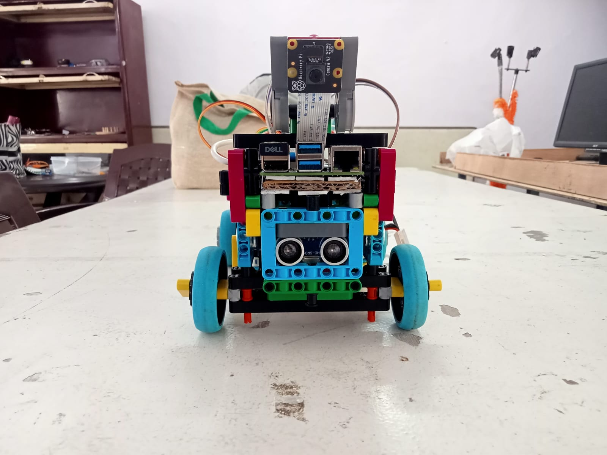
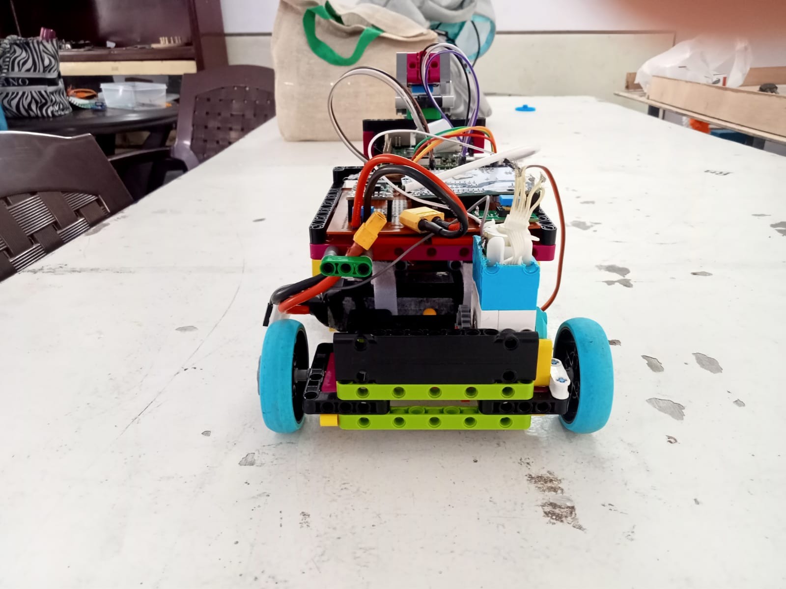
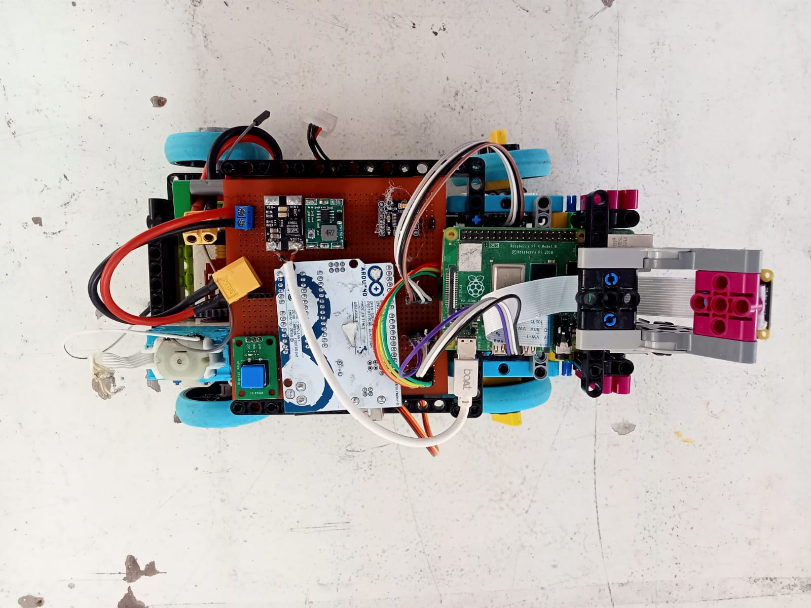
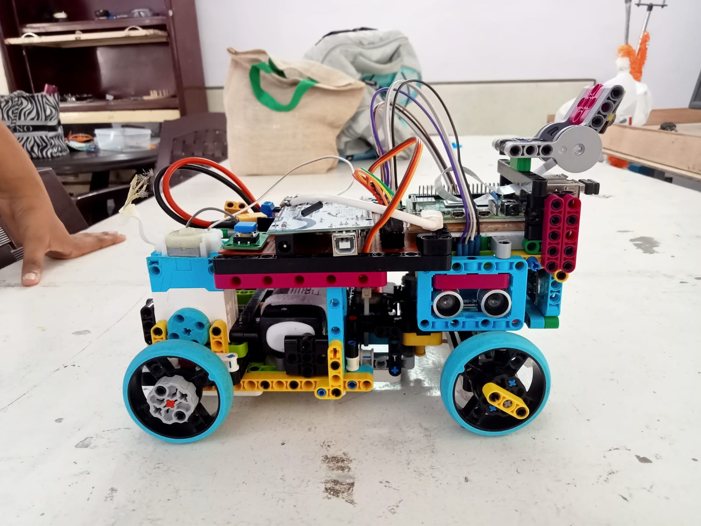
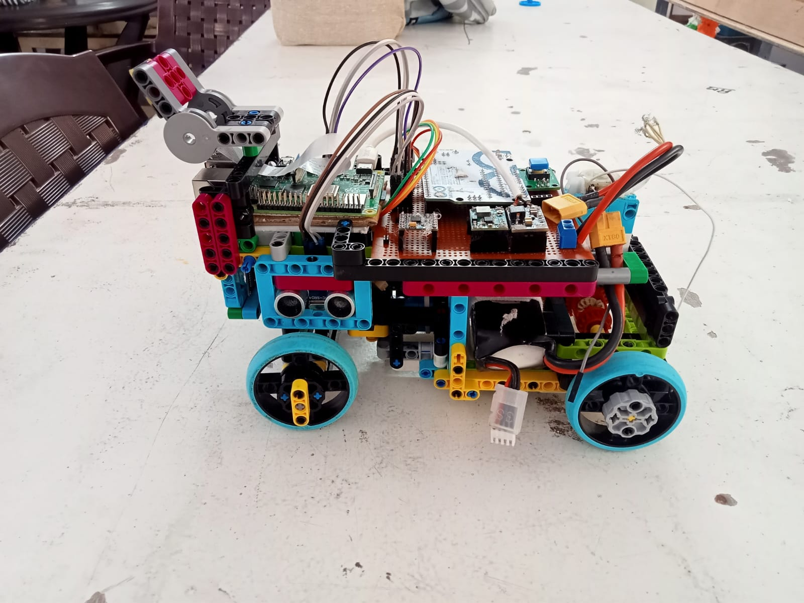
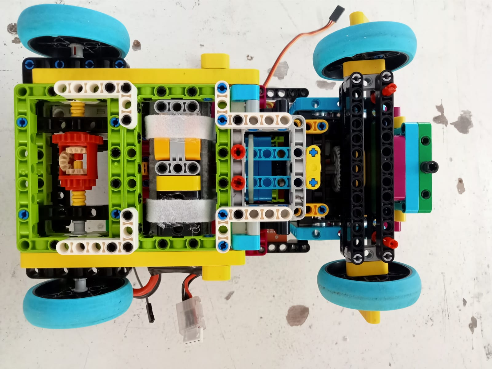

# Vehicle Photos

TODO: Add details to vehicle photos using arrow indications and list components visible in each view

This folder contains photos of Team Aurum-TriMech's WRO 2026 Future Engineers robot vehicle. These photos potray the compact desing and engineering of the vehicle.

## Photo List
### Front View - `front_view.jpg`

### Rear View - `rear_view.jpg`  

### Top View - `top_view.jpg`

### Left View - `left_view.jpg`

### Right View - `right_view.jpg`

### Bottom View - `bottom_view.jpg`

---